# Project 1

## Intro

### Task 5

- 在这个任务中，我们将使用一个包含211个国家的12种不同特征及其对应的预期寿命的数据集。该数据集名为“life_indicator_2008-2018.xlsx”。我们的目标是使用这些特征来预测“出生时的预期寿命”。主要任务包括使用2008年的数据来训练模型，然后基于该训练模型预测2018年的预期寿命。本任务包括以下步骤：

  a. 数据理解 (30%)

  - 了解12个特征中的每一个，并猜测哪些特征可能对预期寿命有显著影响。
  - 使用热图可视化特征之间的关系，查看它们之间的相关性。
  - 查看出生时预期寿命的分布情况，了解其范围和变异性。
  - 使用不同的方法处理任何缺失数据，并比较其有效性。

  b. 建模 (30%)

  - 尝试不同的模型来完成预测任务，考虑复杂性和可解释性等因素。
  - 使用MSE和R²等指标评估每个模型的性能并进行比较。
  - 确定哪些特征对预测预期寿命最重要，并解释如何做出此判断。

  c. 预测分析 (20%)

  - 可视化2018年预测的预期寿命值与实际值之间的差异。寻找任何异常值并尝试解释其原因。
  - 检查预测误差的分布，查看是否存在任何模式或意外趋势。

  d. 模型改进 (20%)

  - 尝试诸如逐步前向选择等高级技术来改进模型的性能。
  - 尝试创建新的特征以提高性能，例如在健康状态预测任务中，从体重和身高得出的体重指数（BMI）可能是一个很好的高层次指标。

  e. 额外任务 (10%)

  - 是否可以基于步骤d训练的模型以及2008年至2018年间的特征（不包括“出生时的预期寿命”）来预测2024年的预期寿命？

## Report

### Task 5

#### Part a

该数据集包含了211个国家从2008年到2018年对预期寿命有影响的12个不同的特征，这些特征涉及经济、健康、教育和环境等方面。这些特征包括：

1. **农林渔业增加值占GDP的比例**：较高的比例可能指示一个国家经济依赖于初级产业，这可能与较低的生活水平和寿命相关。
2. **年度淡水提取量占内部资源的比例**：水资源的过度开采可能影响公共卫生和农业产出，从而影响寿命。
3. **当前卫生支出占GDP的比例**：通常，较高的卫生支出与更好的医疗服务和较高的寿命预期相关。
4. **森林面积占土地面积的比例**：较高的森林覆盖率可能与较好的环境质量和较高的寿命相关。
5. **国内生产总值（GDP）**：GDP较高的国家通常有更好的医疗设施和生活标准，可能导致更长的寿命。
6. **麻疹免疫接种率**：较高的接种率通常与较好的公共卫生体系和较高的儿童存活率相关，可能影响总体寿命预期。
7. **收入中最低20%的收入份额**：经济平等更大的社会通常有更高的生活标准和更长的寿命。
8. **工业增加值占GDP的比例**：较高的工业化水平可能与更好的经济发展和较高的寿命相关，但也可能因环境污染而带来负面影响。
9. **总人口**：人口规模本身可能对寿命影响不大，但与其他因素（如卫生设施的可获得性）交互作用可能有影响。
10. **5岁以下儿童中营养不良的流行率**：儿童营养状况是公共卫生的一个重要指标，直接关系到儿童的生存和发育，可能影响整体寿命。
11. **研发支出占GDP的比例**：较高的研发支出可能指示技术和医疗创新，有助于提高生命质量和预期寿命。
12. **中学入学率**：教育水平较高的国家通常有更好的健康意识和生活方式，可能导致较长的寿命。

根据一般经验，猜测以下特征可能对寿命预期有显著影响：

- **当前卫生支出占GDP的比例**：通常，高卫生支出与更好的医疗设施和服务相关，这可能直接影响国家的平均寿命。
- **麻疹免疫接种率**：高接种率通常反映了较好的公共卫生体系，这与儿童和成年人的健康状况密切相关，进而影响整个社会的寿命预期。
- **5岁以下儿童中营养不良的流行率**：儿童的健康状况是反映国家公共卫生水平的重要指标，营养不良的高流行率可能是较短寿命预期的一个重要因素。
- **中学入学率**：教育水平与寿命之间存在显著相关性，教育水平较高的人群通常有更健康的生活方式和更好的经济条件。

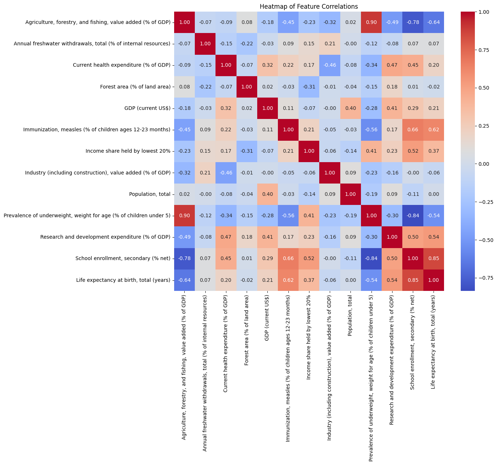

使用相关性矩阵绘制的热图展示了数据集中各特征之间的相关性。通过观察，我们可以得知：

- **生活预期与以下特征有较为显著的负相关性**：
  - **5岁以下儿童中营养不良的流行率**（-0.54）：儿童营养状况不佳与较低的生命预期相关。
  - **农林渔业增加值占GDP的比例**（-0.64）：这可能表示一个国家过度依赖初级产业，通常与较低的经济发展水平和较短的寿命预期相关。
- **与生活预期有较为显著的正相关性**：
  - **中学入学率**（0.85）：这是与生命预期最强相关的特征，说明教育水平的提高可能与长寿命紧密相关。
  - **麻疹免疫接种率**（0.62）：较高的接种率与较高的生命预期相关，反映出良好的公共卫生措施和儿童健康状况。
  - **研发支出占GDP的比例**（0.54）：较高的研发投资可能与医疗和技术创新相关，这些都有助于提高生命质量和预期寿命。
  - **收入中最低20%的收入份额**（0.37）：这表明经济平等程度较高的国家可能有更高的生命预期。

接下来进行寿命预期分布的特征分析：

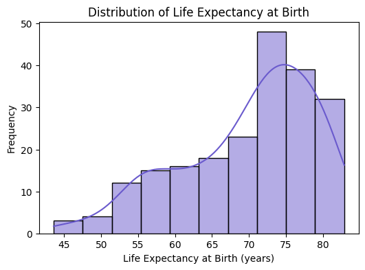

寿命预期的分布显示了各个国家之间存在显著的差异，呈现出明显的左侧长尾分布。这可能受到上述多种因素的影响，包括卫生设施、经济状况、教育水平等。

在代码中，我们对寿命预期进行了描述性统计，并绘制了箱线图：

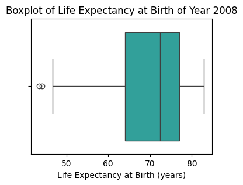

根据寿命预期的描述性统计和箱线图，我们可以观察到2008年的寿命预期分布有以下特点：

- **最小值**：43.57年，这是观察到的最低寿命预期。
- **最大值**：82.89年，这是观察到的最高寿命预期。
- **平均值**：约69.89年，显示了数据的中心趋势。
- **中位数**：72.41年，位于数据的中间，说明数据相对平衡，没有极端偏斜。
- **标准差**：约9.02年，表示寿命预期的变异性相对较大。
- **第25分位数和第75分位数**：63.97年、76.94年，表明大部分数据位于这个范围内。

下一步，处理缺失数据。首先进行缺失数量统计，可以看到，数据集中有多个特征存在缺失值，尤其是“5岁以下儿童中营养不良的流行率”、“收入中最低20%的收入份额”、“中学入学率”和“研发支出占GDP的比例”缺失值较多（>100）。

```python
Forest area (% of land area)                                           7
GDP (current US$)                                                      9
Agriculture, forestry, and fishing, value added (% of GDP)            17
Industry (including construction), value added (% of GDP)             18
Immunization, measles (% of children ages 12-23 months)               22
Current health expenditure (% of GDP)                                 27
Annual freshwater withdrawals, total (% of internal resources)        38
Research and development expenditure (% of GDP)                      113
School enrollment, secondary (% net)                                 117
Income share held by lowest 20%                                      136
Prevalence of underweight, weight for age (% of children under 5)    184
```

测试使用**均值填补**、**中位数填补**和**众数填补**，我们观察实施填补后各特征的统计描述变化，分析可知：

- **均值填补**保留了特征的平均值，但可能减小了标准差，使数据分布更集中，适用于具有正态分布或接近正态分布的数值型数据。
- **中位数填补**可能更适用于偏态分布的特征，因为它不像均值那样容易受到极端值的影响。
- **众数填补**则适用于分类特征或那些有明显最常见值的特征，但对于连续特征来说，如果众数不明显，则可能需要依赖其他方法，如均值或中位数。

分析可知，根据特征数据的特点，使用均值或中位数填补更加合适。实际操作中，我们通过观察每个特征分布特点，依次判断采用均值还是中位数填补：（`key_of_imputation_method = 'check_skewness'`)；同时，还提供了均使用中位数地填补方法以供分析和测试。

```python
{'Agriculture, forestry, and fishing, value added (% of GDP)': 'median',
  'Annual freshwater withdrawals, total (% of internal resources)': 'median',
  'Current health expenditure (% of GDP)': 'median',
  'Forest area (% of land area)': 'mean',
  'GDP (current US$)': 'median',
  'Immunization, measles (% of children ages 12-23 months)': 'median',
  'Income share held by lowest 20%': 'mean',
  'Industry (including construction), value added (% of GDP)': 'median',
  'Population, total': 'median',
  'Prevalence of underweight, weight for age (% of children under 5)': 'mean',
  'Research and development expenditure (% of GDP)': 'median',
  'School enrollment, secondary (% net)': 'mean',
  'Life expectancy at birth, total (years)': 'mean'}
```

经过相应的数据处理后，再次绘制相关性矩阵：

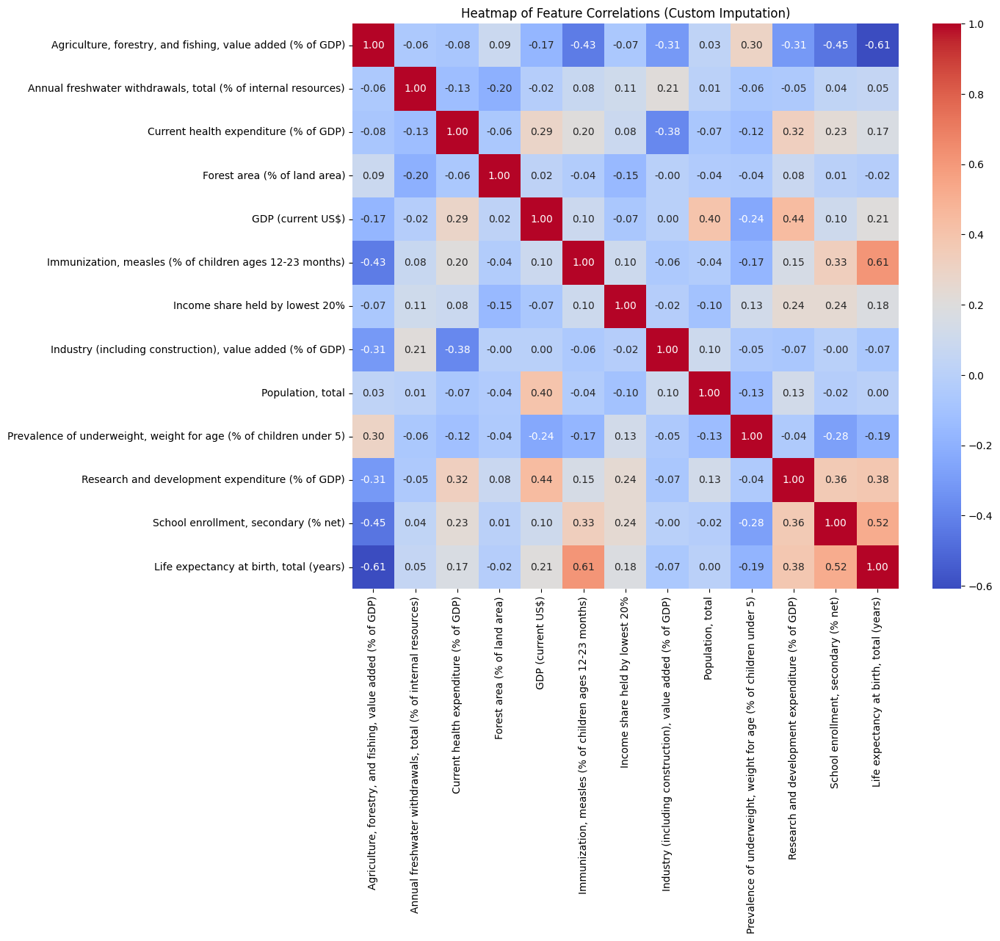

#### Part b

在模型构建任务中，我们尝试了适用于该任务的数种可行的模型，下面是针对每一种模型的具体分析：

- **线性回归**：线性回归是最基本的预测模型，以简单的线性关系对特征和目标变量进行建模。线性回归模型的可解释性非常高，因为可以直接通过系数看出每个特征对预测结果的贡献。线性回归在这个任务中表现一般，解释了大约50.9%的变异性，说明它可能无法捕捉数据中的所有复杂关系。
- **决策树**：决策树通过简单的决策规则对数据进行分割，形成树状结构。它的可解释性较好，但如果树的深度很大，可能导致过拟合，增加模型的复杂性。决策树的表现略低于线性回归，解释了约48.6%的变异性，显示出过拟合的倾向。
- **随机森林**：随机森林由多棵决策树组成，通过投票机制来提高预测的稳定性和准确性。它的复杂性较高，但提供了比单一决策树更好的泛化性能。尽管由多棵树组成，其可解释性仍然不错，可以通过特征重要性来解释。随机森林在所有模型中表现最好，解释了约77.2%的变异性，表明其在处理复杂数据结构方面非常有效。
- **支持向量机 (SVM)**：SVM通过在高维空间中构建最优决策边界来解决分类和回归问题，数学原理使它地可解释性较强。
- **Gradient Boosting**：Gradient Boosting 是一种强大的集成学习技术，通过逐步修正前一个模型的错误来增强预测性能。它的复杂性较高，可解释性中等。Gradient Boosting 的表现优于大多数模型，解释了约75.4%的变异性，证明了其对于复杂非线性关系的良好捕捉能力。
- 除此之外，我们还尝试了**结合最优参数PCA的线性回归**模型：首先对数据进行PCA降维，同时进行网格搜索，以求表现最好的主成分及维数，其解释性较为复杂，最终的重要特征是经过提取和混杂的主成分，效果相较于线性回归有所提高。

```python
[+] Model Comparison:
                    Model        MSE  R2 Score
3           Random Forest  16.172495  0.771721
4       Gradient Boosting  17.430137  0.753970
1      LinearReg with PCA  22.376477  0.684151
0       Linear Regression  34.780320  0.509068
5  Support Vector Machine  36.033214  0.491383
2           Decision Tree  36.442652  0.485603
```

从对比表格中可以看出，Random Forest 模型和 Gradient Boosting 模型的测试性能相对优越，很明显，集成学习方法提供了更强大的预测能力和更好的泛化性能。下面让我们分析在这些模型中具有主要影响的特征：

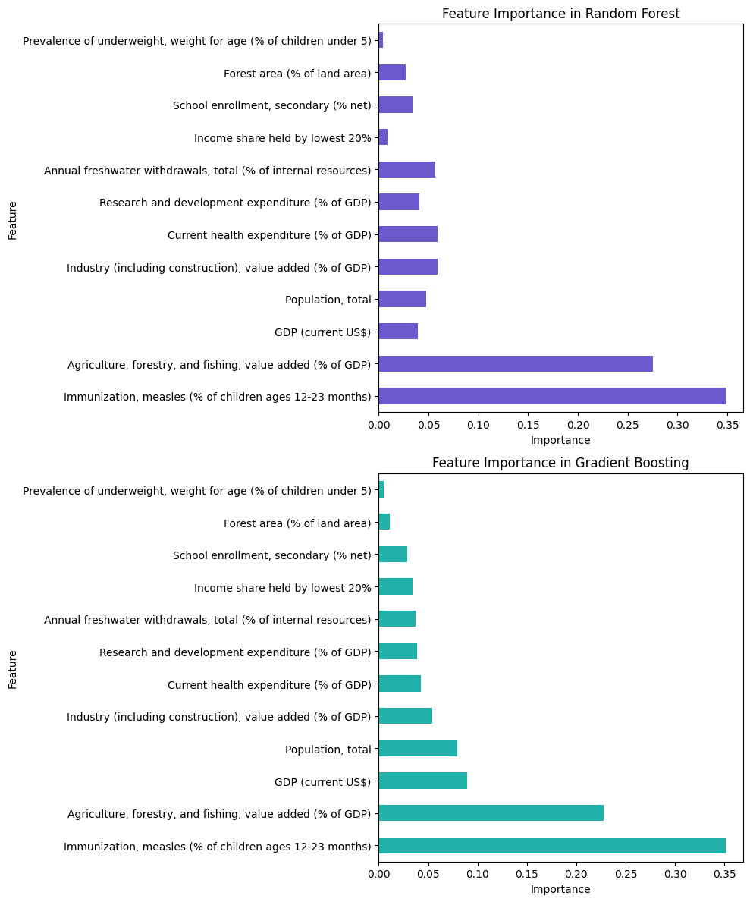

**随机森林模型**中的主要特征：

- **麻疹免疫接种率**：同样是最重要的特征（约34.9%）。
- **农林渔业增加值占GDP的比例**：紧随其后（约27.5%）。

**Gradient Boosting模型**中的主要特征：

- **麻疹免疫接种率**：显著的最高重要性（约35.1%），表明这是影响生命预期的关键因素。
- **农林渔业增加值占GDP的比例**：也很重要（约22.8%），表明经济结构对生命预期有显著影响。
- **GDP (当前美元)**：占有相对较高的重要性（约8.95%）。

这些结果强调了健康措施（如疫苗接种）和经济活动（尤其是与农业相关的）在国家生命预期中的重要性。

与此同时，让我们分析在标准**线性回归模型**中特征的重要性：

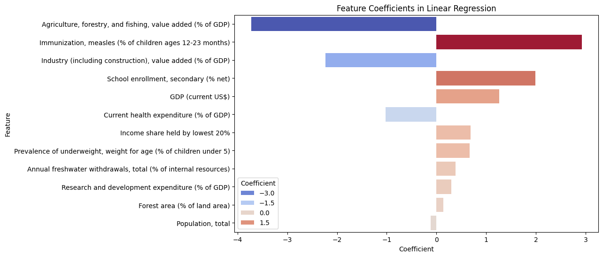

在标准线性回归模型中，特征的重要性可以通过观察每个特征的系数大小来评估。重要性分析表明，“**农林渔业增加值占GDP的比例**”对生命预期有最大的负影响，其系数为 -3.728，该特征的增加可能与生命预期的减少相关。相反，“**麻疹免疫接种率**”对生命预期有显著的正影响，系数为 2.926，说明高接种率与较长的生命预期相关联。这一结果和上述两种模型的结论类似。

此外，“工业（包括建筑）增加值占GDP的比例”和“中学入学率”分别显示出显著的负和正影响，GDP也表现为重要的正向影响因素，强调了工业化程度的重要影响，和教育与经济发展对提高生命预期的重要性。其他特征如“最低20%收入份额”、“营养不良率”等虽影响较小，但仍为正向影响，表明这些因素对提升生命预期有一定贡献。整体而言，这些系数提供了对各个特征如何影响生命预期的直观理解，有助于识别公共卫生和发展策略中的关键干预点。

接下来，**预测2018年寿命预期**。我们提取2018年的数据，并对数据进行与2008年数据相同的预处理和归一化。接着，我们用上述模型依次进行预测预期寿命，预测结果如下图所示：

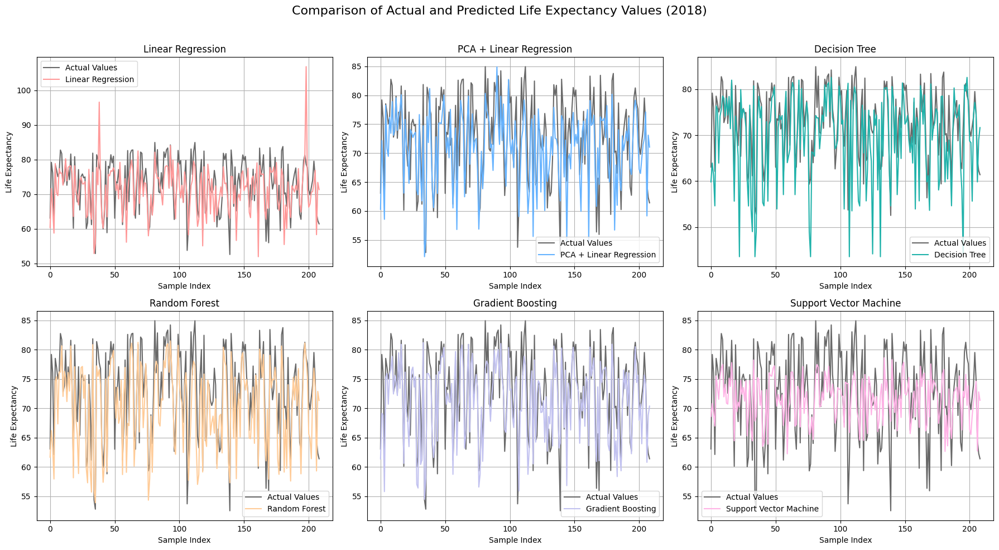

依次评估模型，结果分析如下表所示：

<table border="1" class="dataframe">
  <thead>
    <tr style="text-align: right;">
      <th></th>
      <th>Model</th>
      <th>MSE</th>
      <th>R2 Score</th>
    </tr>
  </thead>
  <tbody>
    <tr>
      <th>4</th>
      <td>Gradient Boosting</td>
      <td>20.105629</td>
      <td>0.648854</td>
    </tr>
    <tr>
      <th>3</th>
      <td>Random Forest</td>
      <td>25.385757</td>
      <td>0.556636</td>
    </tr>
    <tr>
      <th>1</th>
      <td>PCA + Linear Regression</td>
      <td>28.841670</td>
      <td>0.496278</td>
    </tr>
    <tr>
      <th>5</th>
      <td>Support Vector Machine</td>
      <td>30.856629</td>
      <td>0.461087</td>
    </tr>
    <tr>
      <th>0</th>
      <td>Linear Regression</td>
      <td>34.030124</td>
      <td>0.405661</td>
    </tr>
    <tr>
      <th>2</th>
      <td>Decision Tree</td>
      <td>59.194027</td>
      <td>-0.033828</td>
    </tr>
  </tbody>
</table>
- **Gradient Boosting** 模型在2018年的数据上表现最佳，均方误差（MSE）最低，为20.105629，决定系数（R²）最高，为0.648854。
- **随机森林** 模型表现次之，均方误差为25.385757，决定系数为0.556636。
- 将 PCA 方法应用于线性回归模型后，可以看出，对基本的线性回归模型确实有一定的提升。
- **决策树** 模型表现非常差，其R²为负值，说明其预测能力较差。可能是决策树模型无法很好地捕捉数据内在的特征规律。因此，我们将在之后详细误差分析中舍弃这一模型。

#### Part c

> c. 预测分析 (20%)
>
> - 可视化2018年预测的预期寿命值与实际值之间的差异。寻找任何异常值并尝试解释其原因。
> - 检查预测误差的分布，查看是否存在任何模式或意外趋势。

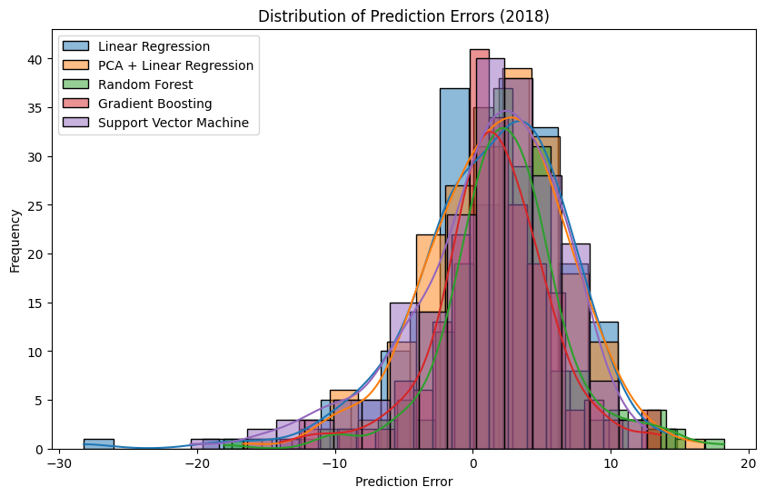

我们对五种建模方法的预测误差进行了可视化，可以看到前面测试中较优的两种方法的预测误差总体上较小。除此之外，我们尝试找出误差绝对值最大的前20个数据进行分析：

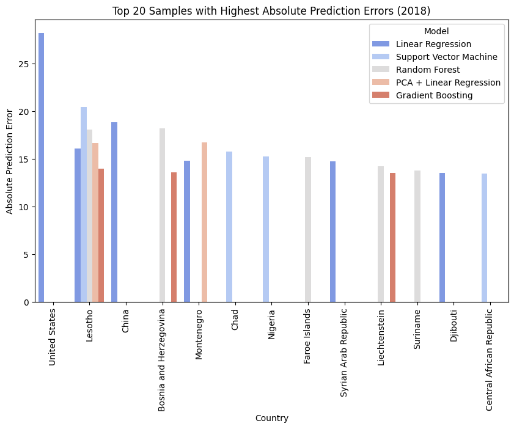

<table border="1" class="dataframe">
  <thead>
    <tr style="text-align: right;">
      <th></th>
      <th>Actual</th>
      <th>Country</th>
      <th>Model</th>
      <th>Error</th>
      <th>Absolute Error</th>
    </tr>
  </thead>
  <tbody>
    <tr>
      <th>198</th>
      <td>78.639024</td>
      <td>United States</td>
      <td>Linear Regression</td>
      <td>-28.211275</td>
      <td>28.211275</td>
    </tr>
    <tr>
      <th>942</th>
      <td>53.733000</td>
      <td>Lesotho</td>
      <td>Support Vector Machine</td>
      <td>-20.474818</td>
      <td>20.474818</td>
    </tr>
    <tr>
      <th>38</th>
      <td>77.744000</td>
      <td>China</td>
      <td>Linear Regression</td>
      <td>-18.848188</td>
      <td>18.848188</td>
    </tr>
    <tr>
      <th>440</th>
      <td>77.093000</td>
      <td>Bosnia and Herzegovina</td>
      <td>Random Forest</td>
      <td>18.203954</td>
      <td>18.203954</td>
    </tr>
    <tr>
      <th>524</th>
      <td>53.733000</td>
      <td>Lesotho</td>
      <td>Random Forest</td>
      <td>-18.060887</td>
      <td>18.060887</td>
    </tr>
    <tr>
      <th>336</th>
      <td>76.841463</td>
      <td>Montenegro</td>
      <td>PCA + Linear Regression</td>
      <td>16.754975</td>
      <td>16.754975</td>
    </tr>
    <tr>
      <th>315</th>
      <td>53.733000</td>
      <td>Lesotho</td>
      <td>PCA + Linear Regression</td>
      <td>-16.640875</td>
      <td>16.640875</td>
    </tr>
    <tr>
      <th>106</th>
      <td>53.733000</td>
      <td>Lesotho</td>
      <td>Linear Regression</td>
      <td>-16.063521</td>
      <td>16.063521</td>
    </tr>
    <tr>
      <th>871</th>
      <td>52.825000</td>
      <td>Chad</td>
      <td>Support Vector Machine</td>
      <td>-15.756408</td>
      <td>15.756408</td>
    </tr>
    <tr>
      <th>975</th>
      <td>52.554000</td>
      <td>Nigeria</td>
      <td>Support Vector Machine</td>
      <td>-15.271161</td>
      <td>15.271161</td>
    </tr>
    <tr>
      <th>478</th>
      <td>82.595122</td>
      <td>Faroe Islands</td>
      <td>Random Forest</td>
      <td>15.156126</td>
      <td>15.156126</td>
    </tr>
    <tr>
      <th>127</th>
      <td>76.841463</td>
      <td>Montenegro</td>
      <td>Linear Regression</td>
      <td>14.795618</td>
      <td>14.795618</td>
    </tr>
    <tr>
      <th>181</th>
      <td>70.145000</td>
      <td>Syrian Arab Republic</td>
      <td>Linear Regression</td>
      <td>14.715223</td>
      <td>14.715223</td>
    </tr>
    <tr>
      <th>527</th>
      <td>83.041463</td>
      <td>Liechtenstein</td>
      <td>Random Forest</td>
      <td>14.205284</td>
      <td>14.205284</td>
    </tr>
    <tr>
      <th>733</th>
      <td>53.733000</td>
      <td>Lesotho</td>
      <td>Gradient Boosting</td>
      <td>-13.989865</td>
      <td>13.989865</td>
    </tr>
    <tr>
      <th>595</th>
      <td>72.553000</td>
      <td>Suriname</td>
      <td>Random Forest</td>
      <td>13.795948</td>
      <td>13.795948</td>
    </tr>
    <tr>
      <th>649</th>
      <td>77.093000</td>
      <td>Bosnia and Herzegovina</td>
      <td>Gradient Boosting</td>
      <td>13.609379</td>
      <td>13.609379</td>
    </tr>
    <tr>
      <th>736</th>
      <td>83.041463</td>
      <td>Liechtenstein</td>
      <td>Gradient Boosting</td>
      <td>13.510497</td>
      <td>13.510497</td>
    </tr>
    <tr>
      <th>50</th>
      <td>63.038000</td>
      <td>Djibouti</td>
      <td>Linear Regression</td>
      <td>-13.505355</td>
      <td>13.505355</td>
    </tr>
    <tr>
      <th>870</th>
      <td>54.369000</td>
      <td>Central African Republic</td>
      <td>Support Vector Machine</td>
      <td>-13.473208</td>
      <td>13.473208</td>
    </tr>
  </tbody>
</table>
根据以上数据分析，我们可以得知：

1. **美国和中国在线性回归模型中的误差较大**：可能的原因是，美国和中国的生命预期受复杂的社会经济因素影响，导致模型预测不准。这两个国家的数据多样性和复杂性使得线性回归模型难以捕捉所有影响因素。
2. **莱索托在多个模型中的误差都较大**：莱索托在支持向量机、随机森林和PCA+线性回归模型中的误差较大。这可能是由于莱索托的特殊社会经济状况，该国的寿命预期受多种复杂因素影响，模型难以捕捉这些因素。

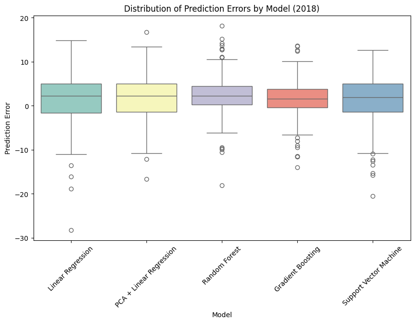

如上图所示，分析各模型误差分布，可以看出：

- Gradient Boosting 和随机森林模型的误差分布较为集中，说明其预测稳定性较好。而其它模型的误差分布较为分散，稳定性较差；
- 各个模型的预测误差总体上分布偏向正值，并不居中，而 Gradient Boosting 中位数更接近 0，且异常值偏负；

由此可知，可能有某些潜在的特征因素导致其中位数均为正，或许可以考虑年份差异带来的影响，也就是说，总体上寿命预期在随时间增加。

#### Part d

继续使用前文中根据偏度插补的数据处理方法，测试逐步向前选择模型的效果：

```python
                                        OLS Regression Results                                      
 ===================================================================================================
 Dep. Variable:     Life expectancy at birth, total (years)   R-squared:                       0.606
 Model:                                                 OLS   Adj. R-squared:                  0.596
 Method:                                      Least Squares   F-statistic:                     62.78
 Date:                                     Tue, 28 May 2024   Prob (F-statistic):           2.01e-39
 Time:                                             23:48:19   Log-Likelihood:                -661.61
 No. Observations:                                      210   AIC:                             1335.
 Df Residuals:                                          204   BIC:                             1355.
 Df Model:                                                5                                         
 Covariance Type:                                 nonrobust                                         
 ======================================================================================================
                                                                  coef    std err          t      P>|t|
 ------------------------------------------------------------------------------------------------------
 const                                                         46.9640      3.931     11.948      0.000
 Immunization, measles (% of children ages 12-23 months)        0.2411      0.033      7.236      0.000
 Agriculture, forestry, and fishing, value added (% of GDP)    -0.3076      0.047     -6.495      0.000
 School enrollment, secondary (% net)                           0.0952      0.028      3.362      0.001
 Industry (including construction), value added (% of GDP)     -0.0975      0.031     -3.126      0.002
 Research and development expenditure (% of GDP)                
 ==============================================================================
 Omnibus:                       55.113   Durbin-Watson:                   2.014
 Prob(Omnibus):                  0.000   Jarque-Bera (JB):              125.407
 Skew:                          -1.202   Prob(JB):                     5.87e-28
 Kurtosis:                       5.925   Cond. No.                     1.16e+03
 ==============================================================================
```

逐步向前选择过程选择了以下对预测预期寿命具有重要意义的特征：

- 免疫接种、麻疹（12-23 个月儿童的百分比）
- 农业、林业和渔业，增加值（占 GDP 的百分比）
- 中学入学率（净百分比）
- 工业（包括建筑业）增加值（占GDP的百分比）
- 研究与开发支出（占 GDP 的百分比）

利用这些特征建立回归模型，该模型提供了以下结果：

- $R^2$ 为 0.606，表明拟合较好。
- Durbin-Watson 统计量 2.014，表明残差没有明显的自相关性。
- 该模型的条件数为 1.16e+03，表明输出对输入噪声比较敏感。

利用该模型对2018年预期寿命进行预测，评估结果如下：

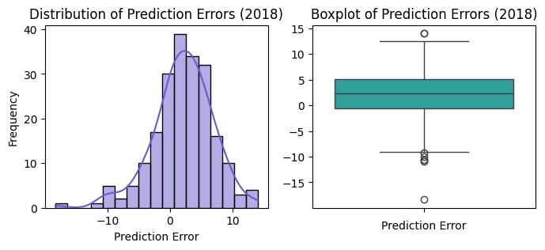

- $MSE$：27.26；
- $R^2$​：0.52。

同时，我们测试了仅使用中位数填充的方法，逐步向前选择模型的效果稍差于上述模型，证明了偏度插补有一定的优化效果。

接着，我们尝试添加两个新的指标：

1. **研发支出占GDP的比重乘以GDP总量**：这一指标综合了研发投资相对规模和绝对规模的影响。
2. **农业、林业和渔业增加值占GDP的百分比乘以GDP总量**：该指标同样将该行业对GDP的相对贡献与整体GDP规模结合起来，以提供更全面的指标。

经过测试，我们发现，与研发支出和农业增加值乘以 GDP 相关的新特征具有较高的 p 值（分别为 0.921 和 0.427），表明在存在其他变量的情况下，它们不是统计上显著的预测因子。同时，结果并没有得到较大的改善。

最后，我们尝试使用 Stacking 集成表现较好的模型，发现相对于梯度提升模型改善不大 。`{'MSE': 22.49936917320978, 'R2': 0.6070467392389411}`

#### Part e

首先，测试使用 ARIMA 模型为每个特征使用每年全球均值，来预测 2024 年的特征全球均值：

```python
{'Agriculture, forestry, and fishing, value added (% of GDP)': 9.70904557622477,
 'Annual freshwater withdrawals, total (% of internal resources)': 127.90736954292113,
 'Current health expenditure (% of GDP)': 6.431269395675334,
 'Forest area (% of land area)': 31.51066325514962,
 'GDP (current US$)': 423044275280.98785,
 'Immunization, measles (% of children ages 12-23 months)': 87.26246602053227,
 'Income share held by lowest 20%': 7.05005449282206,
 'Industry (including construction), value added (% of GDP)': 25.70417844407797,
 'Population, total': 39068493.48112622,
 'Prevalence of underweight, weight for age (% of children under 5)': 13.231325557515934,
 'Research and development expenditure (% of GDP)': 1.0132775165796215,
 'School enrollment, secondary (% net)': 72.99782540973887}
```

然后，使用训练好的 **Gradient Boosting** 模型预测 2024 年的预期寿命全球均值：

```python
[+] Predicted Global Life Expectancy for 2024: 75.25843842766987
```

测试完毕后，我们单独抽离每个国家的数据，分别预测 2024 年的预期寿命。例如，阿富汗的特征预测如下：

```python
{'Agriculture, forestry, and fishing, value added (% of GDP)': 24.295929434490677,
 'Annual freshwater withdrawals, total (% of internal resources)': 43.01590668080594,
 'Current health expenditure (% of GDP)': 18.577392279867563,
 'Forest area (% of land area)': 1.852781994081842,
 'GDP (current US$)': 17525621088.749435,
 'Immunization, measles (% of children ages 12-23 months)': 72.24082574959539,
 'Income share held by lowest 20%': 0.0,
 'Industry (including construction), value added (% of GDP)': 13.026197090015543,
 'Population, total': 42821080.59846224,
 'Prevalence of underweight, weight for age (% of children under 5)': 18.60169812740854,
 'Research and development expenditure (% of GDP)': 0.0,
 'School enrollment, secondary (% net)': 56.861998744214965}
```

阿富汗 2024 年的预期寿命预测为：

```python
[+] Predicted Life Expectancy for Afghanistan in 2024: 58.59048994742795
```

由于阿富汗在两个特征中数据缺失较多，预测结果不一定准确，接着我们抽象出这种方法，对 USA 进行测试：

```python
def forecast_country_features(country_data, features_to_forecast, forecast_years=6):
    """
    Forecast the specified features for a given country's time series data up to a number of additional years.
    
    Parameters:
    - country_data (dict): A dictionary where keys are features and values are lists of historical data.
    - features_to_forecast (list): A list of feature names to forecast.
    - forecast_years (int): Number of years to forecast into the future.
    
    Returns:
    - dict: A dictionary containing the forecasted values for each feature for the last forecast year.
    """
    forecasts = {}
    for feature in features_to_forecast:
        if feature in country_data and len(country_data[feature]) > 2:
            # Fill missing values using forward-fill first, then back-fill
            values = pd.Series(country_data[feature])
            filled_values = values.ffill().bfill()

            # Build and fit ARIMA model if sufficient data
            try:
                model = ARIMA(filled_values, order=(1,1,1))
                model_fit = model.fit()
                # Forecast up to the specified forecast year
                forecast_result = model_fit.get_forecast(steps=forecast_years)
                forecasts[feature] = forecast_result.predicted_mean.iloc[-1]
            except Exception as e:
                forecasts[feature] = None
                print(f"Error forecasting {feature}: {str(e)}")
        else:
            forecasts[feature] = None
            print(f"Not enough data to forecast {feature}")

    return forecasts
```

USA 测试结果如下所示：

```python
{'Agriculture, forestry, and fishing, value added (% of GDP)': 0.9060956964112822,
 'Annual freshwater withdrawals, total (% of internal resources)': 15.758834105052925,
 'Current health expenditure (% of GDP)': 16.65657708458864,
 'Forest area (% of land area)': 33.92044327169513,
 'GDP (current US$)': 20533082985719.812,
 'Immunization, measles (% of children ages 12-23 months)': 91.6405371872185,
 'Income share held by lowest 20%': 5.230430219850322,
 'Industry (including construction), value added (% of GDP)': 18.629626514011125,
 'Population, total': 337558174.9505023,
 'Prevalence of underweight, weight for age (% of children under 5)': 0.39999400231416793,
 'Research and development expenditure (% of GDP)': 3.193668350903618,
 'School enrollment, secondary (% net)': 94.31543956631843}
 
 # [+] Predicted Life Expectancy for the USA in 2024: 74.45230375409596
```

对于其他国家，我们可以应用这种方法进行类似的处理。
